# CMSC848F: Assignment 4
**Submission By: Vineet Singh**

## Data Preparation
Download zip file (~2GB) from https://drive.google.com/file/d/1wXOgwM_rrEYJfelzuuCkRfMmR0J7vLq_/view?usp=sharing. Put the unzipped `data` folder under root directory. There are two folders (`cls` and `seg`) corresponding to two tasks, each of which contains `.npy` files for training and testing.

## Running the code
A bash script is provided which will run all the script to generate output for all the sections. 

1. Copy the data folder within this root folder of Assignment4_vsingh03. 

2. First make the bash file executable by running the below command after navigating to root folder of this directory. 

        chmod +x submission.sh

3. Now run the script using the below command. This will run the script to generate all the output. The output results will be stored in results folder. 

        ./submission.sh

4. The outputs will be generated in output folder. 

## The above code runs only the inference from the pretrained model with provided checkpoints. The checkpoints are not uploaded on Github. To retrain the model use the below instructions. 

For re-training classification model
```bash
python train.py --task cls
```

For re-training segmentation model
```bash
python train.py --task seg
```


# Results

All models are trained with **batch size of 8**. 

# Section 1: Classification Model
-------------------------------------------------------------------------------

## Accuracy on classification task: 

Experiment section1_result <br>
Class chair Number of Point 10000 Rotation X:0 Y:0 Z:0 <br>
Test Accuracy: 0.9716684155299056. <br>

**A detailed accuracy report for many combinations of Classification task is generated in "classification_experiment_results.txt"** 

Visualization of Classification results. (All at 10K points trained with batch size of 8)


### Correctly classified instances 

|Point Cloud |Predicted class |Ground Truth| 
| --- | ----   |   --- |
|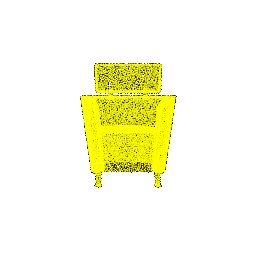 | Chair | Chair |
|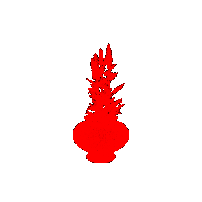 | Vase | Vase |
|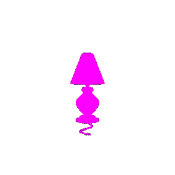 | Lamp | Lamp |


### Incorrectly classified instances 

|Point Cloud |Predicted class |Ground Truth| 
| --- | ----   |   --- |
|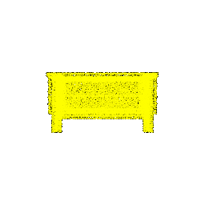 | Chair | Vase |
|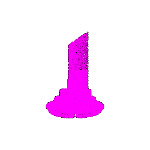 | Lamp | Vase |
|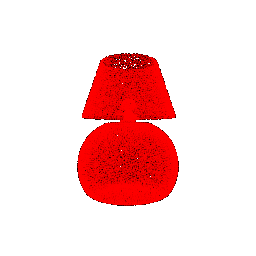 | Vase | Lamp |


### Interpretation
The model misclassifies instances when the subject is very similar to objects from other class. For example, the Lamp sample misclassified is very similar to vases with a round bottom section. 
Same is observed for vase misclassification as chair, which has elongated segments and hence the misclassification.  


# Section 2: Segmentation Model
-------------------------------------------------------------------------------

### Correctly classified instances 

|Ground Truth Segmentation |Predicted segmentation |  
| --- | --- |
|  | 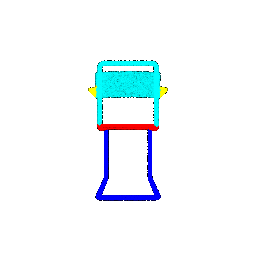 |
| 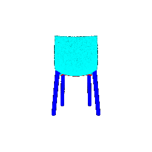 | 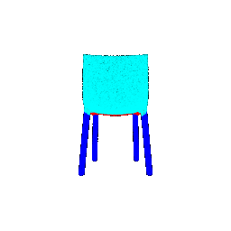 |
| 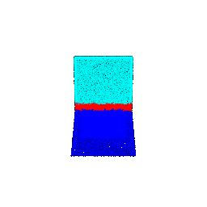 | 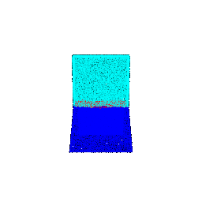 |


### Incorrectly classified instances 

|Ground Truth Segmentation |Predicted segmentation | 
| --- | --- |
| 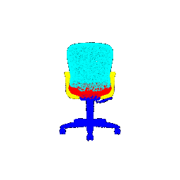 | 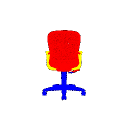 |
| 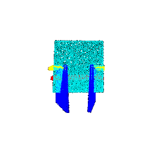 | 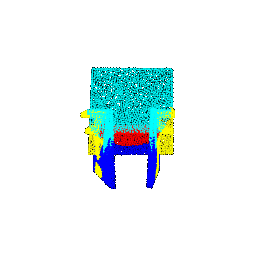 |
| 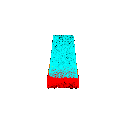 | 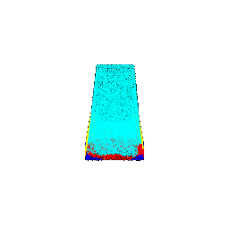 |


### Interpretation
For segmenting a model, the network needs to properly draw segments which is difficult if the object has merging boundaries. This leads to classification of multiple objects as a single unit.
This can be also seen in the misclassification results where the entire upper part of the chair is classified as one unit whereas GT is two segments for the part. 

 
# Section 3: Robustness Analysis 
-------------------------------------------------------------------------------
The model is inferred with different amounts of rotations (15, 45, 90) and varying number of points (100, 2K, 5K). <br>

Most of the code written in eval_seg.py and eval_cls.py is to automate the robustness analysis. All inputs are taken as parameters, and the model with all combinations of parameters using a bash script. 
The test data is loaded from the data loader and random samples are tested for classification and segmentation tasks. The accuracy is based on the complete batch results. The data is broken into mini-batches 
and the results are aggregated into a final accuracy. There is one final accuracy calculated for each experiment. <br>

Here we see that with increase in rotation, the accuracy decreases for classification, as the model is trained on objects in just one pose. So with increasing rotation, the object resemblance downgrades
w.r.t. the training data, and hence the accuracy falls. Same is the case with Segmentation where the training data has more segmentation with horizontal boundaries and when the object is rotated, the model tries 
to find segments with horizontal boundaries and loses accuracy. <br>

**The rotations are done using rotation matrices (one for each azimuth angle) and are derived from the following reference : https://www.brainm.com/software/pubs/math/Rotation_matrix.pdf **

Below charts show the comparisons. There are multiple comparisons done in output, and only one sample is presented in this report. Rest can be referred from the output folder in the submission package. 

## Classification Robustness Analysis ##

**Correct classification at different angles:**

Test Accuracy at 15 degrees rotation in x,y,z direction: 0.9087093389296957. <br>
Test Accuracy at 45 degrees rotation in x,y,z direction: 0.7124868835257083. <br>
Test Accuracy at 90 degrees rotation in x,y direction:   0.29800629590766003. <br>

|Point Cloud |Predicted class |Ground Truth| Rotation Angle | 
| --- | ----   |   --- | --- |
|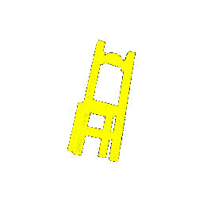 | Chair | Chair | 15deg in x, y, z |
|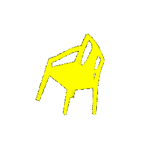 |  Chair | Chair | 45deg in x, y, z |
|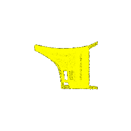 |  Chair | Chair | 90deg in x, y |


**Incorrect classification at different angles:**

|Point Cloud |Predicted class |Ground Truth| Rotation Angle | 
| --- | ----   |   --- | --- |
|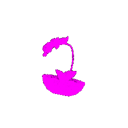 | Lamp | Vase | 15deg in x, y, z |
|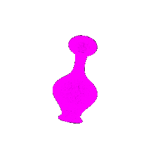 |  Lamp | Vase | 45deg in x, y, z |
|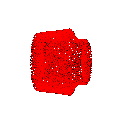 |  Vase | Lamp | 90deg in x, y |


**Correct classification for different number of points:**

Test Accuracy for 100 points in sample space: 0.9045120671563484.  <br>
Test Accuracy for 2000 points in sample space: 0.9727177334732424. <br>
Test Accuracy for 5000 points in sample space:  0.9737670514165793. <br>
Test Accuracy for 10000 points in sample space: 0.9716684155299056. <br>

|Point Cloud |Predicted class |Ground Truth| Number of Points | 
| --- | ----   |   --- | --- |
|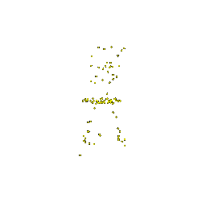 | Chair | Vase | 100 |
|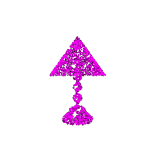 | Lamp | Vase | 2000 |
|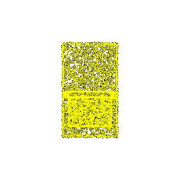 | Vase | Lamp | 5000 |


**Incorrect classification for different number of points:**

|Point Cloud |Predicted class |Ground Truth| Number of Points | 
| --- | ----   |   --- | --- |
|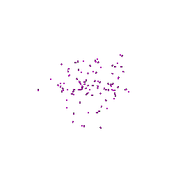|  Lamp | Vase | 100  |
|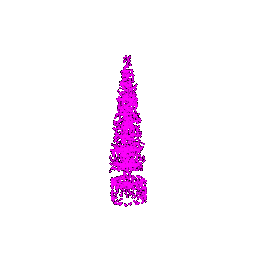 |  Lamp | Vase | 2000 |
|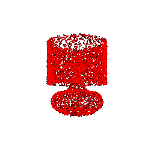 |  Vase | Lamp | 5000 |


## Segmentation Robustness Analysis ##

**Correct segmentation at different angles:**

Test Accuracy at 15 degrees rotation in x,y,z direction:  0.7433123176661264. <br>
Test Accuracy at 45 degrees rotation in x,y,z direction: 0.5285645056726094. <br>
Test Accuracy at 90 degrees rotation in x,y direction:  0.35435964343598053. <br>

|Ground Truth Segmentation |Predicted segmentation | Rotation angle | 
| --- | --- | --- |
| 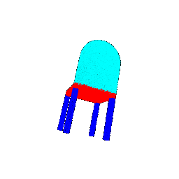 | 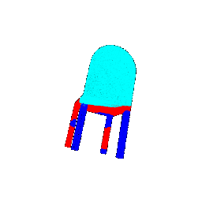 | 15deg in x, y, z |
| 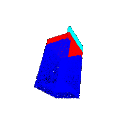 | 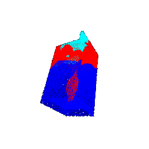 | 45deg in x, y, z |
| No correct samples predicted at 90deg x and y rotation             | No correct samples predicted at 90deg x and y rotation               | 90deg in x, y    |

**Incorrect segmentation at different angles:**

|Ground Truth Segmentation |Predicted segmentation | Rotation angle | 
| --- | --- | --- |
| 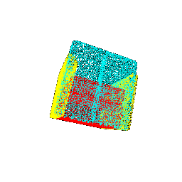 | 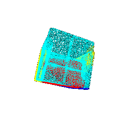 | 15deg in x, y, z |
| 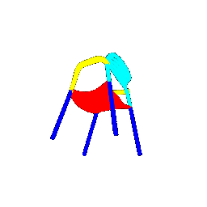 | 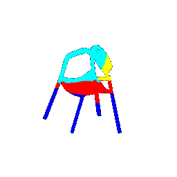 | 45deg in x, y, z |
| 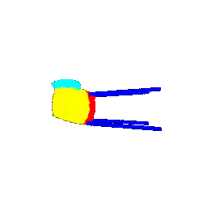 | 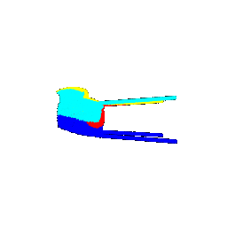 | 90deg in x, y|


**Correct segmentation for different number of points:**

Test Accuracy for 100 points in sample space: 0.7913290113452188. <br>
Test Accuracy for 2000 points in sample space:0.8964708265802269. <br>
Test Accuracy for 5000 points in sample space:0.8973384116693679. <br>
Test Accuracy for 10000 points in sample space: 0.897059319286872. <br>

|Ground Truth Segmentation |Predicted segmentation | Number of Points | 
| --- | --- | --- |
| 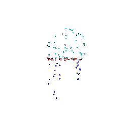 | 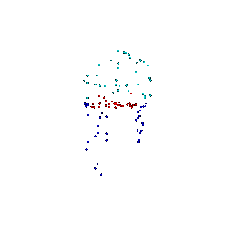 | 100 |
| 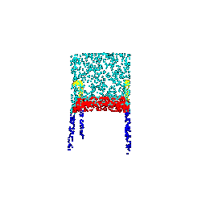 | 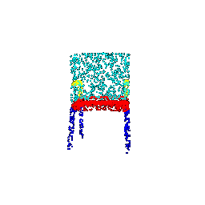 | 2000 |
| 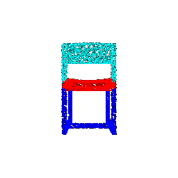 | 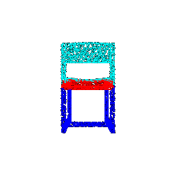 | 5000 |


**Incorrect segmentation for different number of points:**

|Ground Truth Segmentation |Predicted segmentation | Number of Points | 
| --- | --- | --- |
| 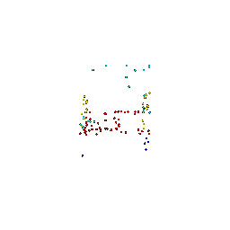 | 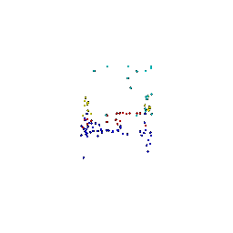 | 100  |
| 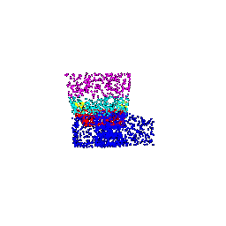 | 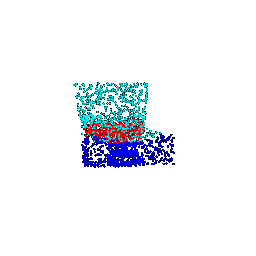 | 2000 |
| 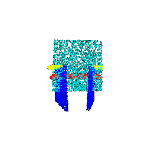 |  | 5000 |


1. The code for section 3 for automating the robustness analysis and efficient use of data loader is referred from the forks of the below github page:
 [assignment5](https://github.com/learning3d/assignment5)
2. The code for colours for segmented parts is referred from the Pointnet paper github: [Pointnet GitHub](https://github.com/charlesq34/pointnet)
